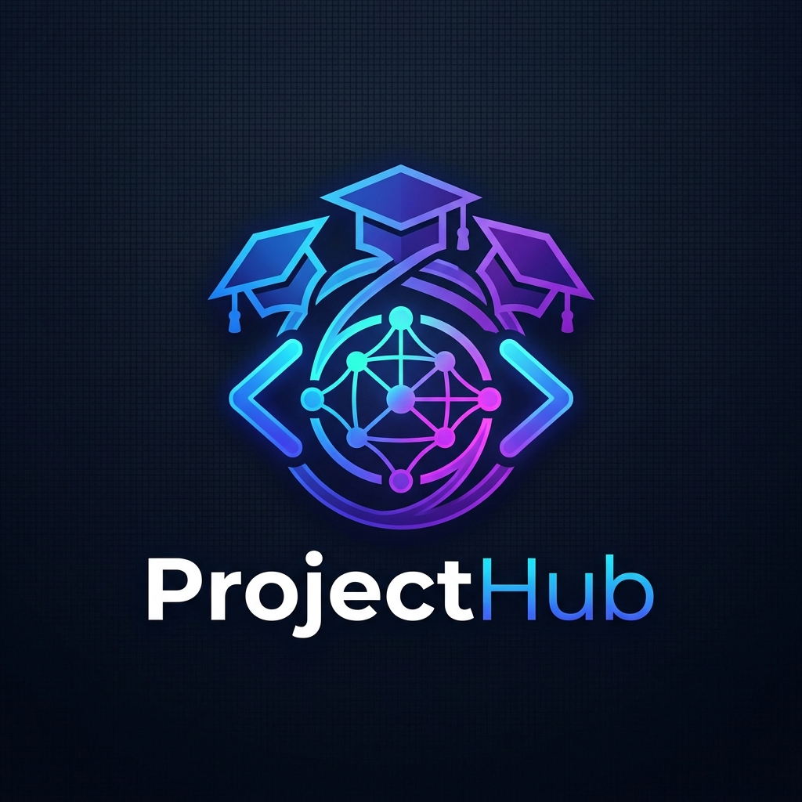

<br/>
<div align="center">
  
  <h1 align="center">ProjectHub</h1>
  <p align="center">
    <strong>Integrated Platform for Cross-University Student Projects</strong>
    <br/>
    An academic ecosystem connecting Students, Universities, and Tech Recruiters..
  </p>
  
  <p align="center">
    <a href="https://projecthub-itpb.onrender.com"><strong>View Live Demo »</strong></a>
  </p>

  <p align="center">
    
    
    
    
    
  </p>
</div>

<br/>

## 📖 About The Project

**ProjectHub** is a comprehensive full-stack platform designed to bridge the gap between academic projects and industry recruitment. By integrating multiple universities onto a single platform, ProjectHub allows students to upload their technical projects, get them peer-reviewed and faculty-approved, and showcase them to a global audience of top-tier recruiters.

### ✨ Key Features

* **Role-Based Authentication System:**
  * **Students:** Secure registration using `.edu` or institutional email verification (OTP-based). Upload, showcase, and monetize projects.
  * **College Admins:** Dedicated dashboard to review, flag for plagiarism, and approve student projects to the Global feed.
  * **Recruiters:** Browse the global talent pool, view top-rated projects, and initiate direct interviews.
* **Code-Syncronix:** A high-performance, real-time collaborative code editor powered by WebSockets, allowing distributed teams to pair-program seamlessly.
* **Project Marketplace:** A platform where students can list premium projects or templates for sale (Integrated with Stripe).
* **Direct Messaging:** Real-time chat system enabling direct communication between recruiters and students.
* **Smart Filtering:** Advanced search across global projects using tech stacks, college codes, and project names.

---

## 🏗️ Architecture & Deployment

ProjectHub uses a **Monolithic Architecture** for streamlined deployment. The React frontend is compiled into static assets and served directly by the robust Node.js/Express backend API. 

The entire stack is currently deployed seamlessly as a unified Web Service on **Render**.

---

## 💻 Tech Stack

### Frontend
* **React 18** (Context API / Redux for state management)
* **React Router DOM** (Client-side routing)
* **Bootstrap 5 & Custom CSS** (Responsive, Dark-mode optimized UI)
* **Socket.io Client** (Real-time interactions)

### Backend
* **Node.js & Express.js** (REST API framework)
* **MongoDB & Mongoose** (NoSQL Database structure)
* **Socket.io** (WebSocket communication for Code-Syncronix and Chat)
* **JWT & Bcrypt** (Stateless authentication and security)
* **Multer** (File and document uploads)
* **Nodemailer** (Automated OTP verification emails)

---

## 🚀 Getting Started

To get a local copy up and running, follow these simple steps.

### Prerequisites

* Node.js (v16 or higher)
* MongoDB Database URI (Local or Atlas)

### Installation

1. **Clone the repository**
   ```sh
   git clone https://github.com/mihirchouhan/Integrated-Platform-for-Cross-University-Student-Projects.git
   cd Integrated-Platform-for-Cross-University-Student-Projects
   ```

2. **Install Frontend Dependencies**
   ```sh
   npm install
   ```

3. **Install Backend Dependencies**
   ```sh
   cd backend
   npm install
   cd ..
   ```

4. **Environment Variables Configuration**
   Create a `.env` file in the `backend` directory and add the following:
   ```env
   PORT=5000
   MONGO_URI=your_mongodb_connection_string
   JWT_SECRET=your_super_secret_jwt_key
   MAIL_SERVICE=gmail
   MAIL_USER=your_email@gmail.com
   MAIL_PASS=your_app_password
   ```

5. **Start the Development Servers**
   
   *Run the Backend:*
   ```sh
   cd backend
   npm run dev
   ```
   
   *Run the Frontend (In a new terminal root):*
   ```sh
   npm start
   ```

---

## 🛡️ Security & Validations

* **Strict Institutional Access:** Student accounts can only be created if their email domain perfectly matches the registered College Domain (e.g., `@iitb.ac.in`).
* **Route Protection:** All API endpoints are secured via JWT bearer tokens and role-based access control middleware (`student`, `collegeAdmin`, `recruiter`).
* **Password Encryption:** Salted and hashed using `bcryptjs`.

---

## 🤝 Contributing

Contributions are what make the open-source community such an amazing place to learn, inspire, and create. Any contributions you make are **greatly appreciated**.

1. Fork the Project
2. Create your Feature Branch (`git checkout -b feature/AmazingFeature`)
3. Commit your Changes (`git commit -m 'Add some AmazingFeature'`)
4. Push to the Branch (`git push origin feature/AmazingFeature`)
5. Open a Pull Request

---

## 📝 License

Distributed under the MIT License. See `LICENSE` for more information.

<div align="center">
  <p>Built with ❤️ for the cross-university academic community.</p>
</div>
